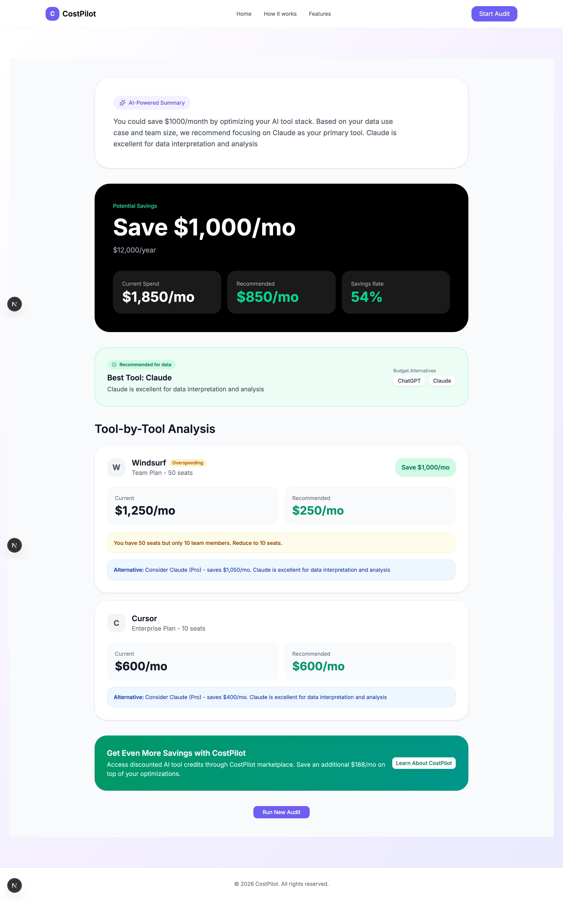

# CostPilot

CostPilot is an AI-powered audit platform that helps teams analyze AI tool subscriptions, reduce unnecessary spending, and discover smarter alternatives.

## Live Demo

[View Live Demo](https://cost-pilot-git-main-ravneet2711s-projects.vercel.app)

## Features

- AI subscription audit
- Smart savings recommendations
- Tool by tool cost analysis
- AI-generated spending summaries
- Responsive UI
- Multi-step audit workflow

## Tech Stack

- Next.js
- React
- Tailwind CSS
- shadcn/ui
- Lucide React

## 📦 Installation

Follow these steps to get a local copy up and running:

### 1. Clone the Repository

```bash
git clone https://github.com/Ravneet2711/Costpilot.git
```

### 2. Install Dependencies

```bash
npm install
```

### 3. Run Development Server

```bash
npm run dev
```

By default, the app will be available at `http://localhost:3000`.

## Screenshots

### Home Page


### Audit Page


### Results Page



## Decisions

### 1. Next.js instead of plain React
Used Next.js for routing, better scalability, and easier deployment.

### 2. Tailwind CSS for UI development
Tailwind allowed rapid iteration and consistent responsive design.

### 3. Rule-based audit engine instead of full AI logic
The assignment specifically emphasized defensible financial reasoning, so hardcoded audit rules were used for recommendations while AI was only used for summaries.

### 4. LocalStorage for audit persistence
Used LocalStorage to preserve form state across page reloads without requiring authentication.

